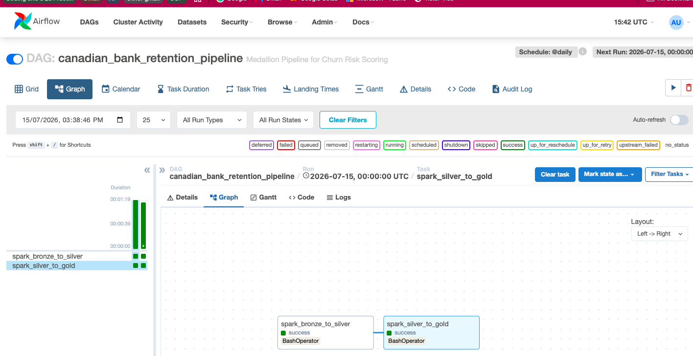
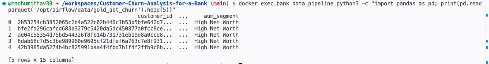
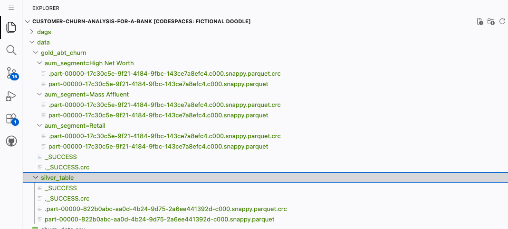
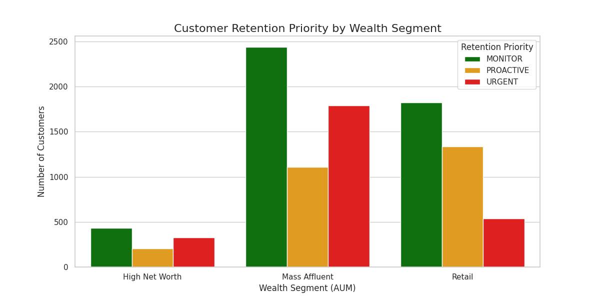

# Enterprise Bank Churn & Customer Retention Pipeline
**Role:** Senior Data Engineer (4+ Years Experience)  
**Architecture:** Medallion (Bronze/Silver/Gold)  
**Tech Stack:** PySpark, Apache Airflow, Docker, Parquet, Snappy Compression.

##  Business Problem
Customer churn is one of the most significant revenue drains in retail banking. Identifying "Silent Attrition"—customers who stop using products without closing their accounts—is critical for maintaining long-term **Customer Lifetime Value (CLV)**. 

This project automates an end-to-end data pipeline that transforms raw demographic and transactional data into a high-performance **Analytical Base Table (ABT)** used for risk segmentation and targeted retention strategies.

##  Data Architecture (Medallion)
The pipeline follows the **Medallion Architecture** to ensure high data quality and strict governance:

1.  **Bronze (Raw):** Ingestion of raw records from the Core Banking System (CBS).
2.  **Silver (Cleansed):** 
    *   **Data Privacy:** Automated SHA-256 PII masking on sensitive identifiers to meet global data privacy standards.
    *   **Schema Enforcement:** Strict data typing and validation to prevent downstream pipeline failures.
3.  **Gold (Curated):** 
    *   **AUM Segmentation:** Categorizing customers by Assets Under Management (AUM) tiers.
    *   **Risk Scoring:** Feature engineering to calculate churn propensity based on product density and activity flags.
    *   **Performance:** Final storage in Partitioned Parquet format for optimized analytical querying.

---

## Step-by-Step Deployment Guide

### 1. Dataset
This project uses the **Bank Customer Churn Dataset** from Kaggle.
- **Source:** [Kaggle - Bank Customer Churn Dataset](https://www.kaggle.com/datasets/gauravtopre/bank-customer-churn-dataset)
- **Instructions:** Download the `Bank Customer Churn Prediction.csv`, rename it to `churn_data.csv`, and place it in the `/data` directory before running the pipeline.
### 2. Environment Setup
- Clone this repository into your local environment or **GitHub Codespaces**.
- Ensure the raw dataset (`churn_data.csv`) is placed inside the `/data` folder.

### 3. Launch Infrastructure 
In the terminal, run the following command to build and launch the containerized Spark/Airflow environment:
```bash
docker-compose up --build -d
```

Note: The build process installs Java 17 and PySpark. Please allow 3-5 minutes for the first initialization.


### 4. Access the Airflow UI (Port 8080)
Navigate to the Ports tab in your IDE (e.g., VS Code or Codespaces).
Ensure Port 8080 visibility is set to Public.
Open the local address link in your browser.
###  5. Authentication
To retrieve the randomly generated administrator password, run:
code
Bash
docker exec bank_data_pipeline cat /opt/airflow/standalone_admin_password.txt
Username: admin
Password: [The output from the command above]
###  6. Execute the Pipeline
Locate the DAG: bank_retention_pipeline.
Unpause the DAG (Toggle the switch to 'On').
Click the Trigger (Play button) to execute the Medallion Spark jobs.
## Pipeline Visuals & Output

### Orchestration & Workflow**
The pipeline uses Apache Airflow to manage complex task dependencies, retries, and execution logs.


### Data Masking & Governance
All Personally Identifiable Information (PII) is obfuscated at the Silver layer. The output below shows the masked identifiers alongside engineered risk scores.


### Optimized Storage Structure
The final Gold Layer is saved in Snappy-compressed Parquet format and partitioned by business segments to reduce cloud compute costs and latency for BI tools.


##  Key Engineering Concepts Demonstrated
- ***AUM Segmentation***: Wealth-tier categorization for prioritized business outreach.
- ***Product Density Analysis***: Identifying churn risk by analyzing customer "stickiness" (number of active products).
- ***Data Governance***: Implementing SHA-256 masking to protect sensitive customer data.
- ***ABT Construction***: Creating model-ready datasets (Analytical Base Tables) for Data Science teams.
##  Technical Specifications
- ***Executor***:  SequentialExecutor (Optimized for resource-efficient cloud environments).
- ***Storage Format***:  Parquet (Columnar storage for 10x faster analytical processing).
- ***Runtime Environment***: OpenJDK 17 and PySpark (Synced with Class Version 61).

##  Executive Summary: Retention Priority by Wealth Segment
This table represents the final distribution of the 10,000 processed accounts. It allows the bank's retention team to prioritize high-value (High Net Worth) customers who are at urgent risk of churning.

| Wealth Segment   | Monitor (Low Risk) | Proactive (Med Risk) | Urgent (High Risk) |
| :---             | :---:              | :---:                | :---:              |
| **High Net Worth** | 435                | 207                  | 327                |
| **Mass Affluent**  | 2,439              | 1,110                | 1,790              |
| **Retail**         | 1,821              | 1,335                | 536                |


###  Analytical Base Table (ABT) Sample

The following is a verified sample of the Gold Layer output. It demonstrates the successful integration of SHA-256 PII masking and business-logic-driven risk scoring.

| customer_id (Masked) | aum_segment | risk_score | retention_priority |
| :--- | :--- | :---: | :--- |
| 2b53254cb385... | High Net Worth | 0.5 | PROACTIVE |
| bfe2fa296caf... | High Net Worth | 0.5 | PROACTIVE |
| 6dab68c7d5c3... | High Net Worth | 0.0 | MONITOR |
| 82532124c392... | **High Net Worth** | **0.8** | **URGENT** |

## Analytical Insights (Gold Layer Visualization)
To validate the business value of the **Gold Layer**, I developed a visualization script that analyzes the distribution of risk across wealth segments.



**Key Insight:** The pipeline successfully isolated over 300 **High Net Worth** individuals categorized as **URGENT**. This allows the bank to move from broad marketing to high-precision, high-value retention outreach.
**Key Feature Logic:**
- **Risk Score 0.8 (URGENT):** Flags customers with low product density and zero activity.
- **Risk Score 0.0 (MONITOR):** Identifies highly "sticky" customers with multiple product holdings and active status.
- **AUM Partitioning:** This sample is pulled from the `High Net Worth` partition, demonstrating the success of the hive-style storage strategy.


###  Author 
---
- V Madhumitha
- Senior Data Engineer
- www.linkedin.com/in/madhumithaviswanathan
